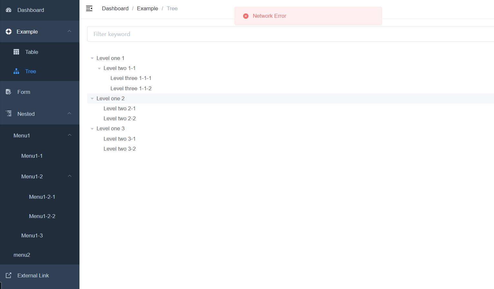

### 2021年2月14日

看了下swagger，发现这玩意要结合后端代码来生成接口文档（flask里是叫flasgger），直接写比较蛋疼，暂且搁置吧。

还看了下mockjs，可以生成前端的数据供测试，原理是拦截所有的请求并代理到本地，然后进行数据模拟。这样可以让前端开发更加独立自主，不会对服务端的开发所阻塞。

还有就是后端找了个模板进行开发，目前还在看他的layout源码，这个模板还使用了比较多scss的样式，明天还需要学习一下。

### 2021年2月13日

学完vue-router和vuex，算是基本把vue的所有基础全部学习完毕了。今天把需求细化和数据库更新掉，明天学习用swagger写接口文档，争取把整个接口文档的初版搞出来。

数据方面由于需求尚不明确，数据库不是很好建，暂时挂起。

### 2021年2月12日

**ES6中一个非常重要和好用的特性就是Promise**

- **Promise到底是做什么的呢？**
- Promise是异步编程的一种解决方案。
- new Promise很明显是创建一个Promise对象
- 小括号中((resolve, reject) => {})也很明显就是一个函数，而且我们这里用的是之前刚刚学习过的箭头函数。
- 我们先知道一个事实：在创建Promise时，传入的这个箭头函数是固定的（一般我们都会这样写）
- resolve和reject它们两个也是函数，通常情况下，我们会根据请求数据的成功和失败来决定调用哪一个。
- 如果是成功的，那么通常我们会调用resolve(messsage)，这个时候，我们后续的then会被回调。
- 如果是失败的，那么通常我们会调用reject(error)，这个时候，我们后续的catch会被回调。
  OK，这就是Promise最基本的使用了。

由于被过年的破事影响，导致进度慢了一些，总共还剩6小时的视频，计划明天早上6点起床刷完，然后下午把需求具体文档写完。因为自己拖慢项目进度真的很抱歉，但又因为身体原因不能熬夜。没有找借口的意思，但就是很尴尬。明天再去学习一下使用swagger生成接口文档

### 2021年2月10日

vue-router笔记

1. 步骤一: 安装vue-router
   `npm install vue-router --save`

2. 步骤二: 在模块化工程中使用它(因为是一个插件, 所以可以通过Vue.use()来安装路由功能)

   使用vue-router的步骤:

   1. 第一步：导入路由对象，并且调用 Vue.use(VueRouter)
      `javascript import Vue from 'vue' import VueRouter from 'vue-router' Vue.use(VueRouter)`

   2. 第二步：创建路由实例，并且传入路由映射配置

   3. 步骤二：配置组件和路径的映射关系

   4. 步骤三：使用路由

   5. `<router-link>`: 该标签是一个vue-router中已经内置的组件, 它会被渲染成一个`<a>`标签.

   6. `<router-view>`: 该标签会根据当前的路径, 动态渲染出不同的组件.

   7. 网页的其他内容, 比如顶部的标题/导航, 或者底部的一些版权信息等会和`<router-view>`处于同一个等级.

   8. 在路由切换时, 切换的是`<router-view>`挂载的组件, 其他内容不会发生改变.

      - 在前面的`<router-link>`中, 我们只是使用了一个属性: to, 用于指定跳转的路径.
      - `<router-link>`还有一些其他属性:

      1. tag: tag可以指定`<router-link>`之后渲染成什么组件, 比如上面的代码会被渲染成一个`<li>`元素, 而不是`<a>`
      2. replace: replace不会留下history记录, 所以指定replace的情况下, 后退键返回不能返回到上一个页面中
      3. active-class: 当`<router-link>`对应的路由匹配成功时, 会自动给当前元素设置一个router-link-active的class, 设置active-class可以修改默认的名称.
         在进行高亮显示的导航菜单或者底部tabbar时, 会使用到该类.
         但是通常不会修改类的属性, 会直接使用默认的router-link-active即可.

#### 明天任务

给出各页面详细需求分析文档

数据库脚本

完成router和vuex的学习

### 2021年2月9日

#### webpack的基本功能和使用

npm init
	创建package.json

UnhandledPromiseRejectionWarning: TypeError: this.getResolve is not a function
	原因：css-loader版本过高

npm install vue-loader vue-template-compiler --save-dev

​	将转化vue文件

npm i -D postcss-loader
	解决scoped中的样式无法加载

npm install html-webpack-plugin --save-dev

#### vuecli的安装和使用

#### 明天任务

* 项目环境搭建

  

